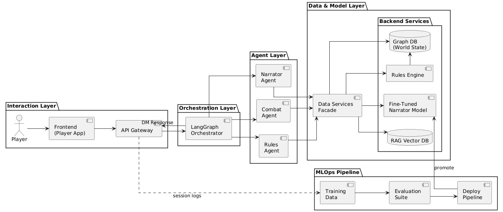

# AC215 - Milestone2 - DnD Master

**Team Members**


**Group Name**
The Bear Dungeon (TBD)

**Project**
ND AI Master is an AI-powered Dungeon Master system that reimagines traditional Dungeons & Dragons gameplay using Retrieval-Augmented Generation (RAG) and Large Language Models (LLMs). The project builds an intelligent storytelling engine that dynamically generates narratives, dialogues, and game events based on player actions. Our system integrates a knowledge base of DnD rules, lore, and gameplay transcripts to ensure consistency and authenticity. Players interact through a chatbot-style interface—choosing characters, exploring maps, and engaging in adaptive adventures—all without needing a human Dungeon Master. The project combines scalable backend infrastructure, multimodal assets, and immersive design to make collaborative storytelling both intelligent and accessible.

### Project Workflow


#### Project Milestone 2 Organization

```
├── Readme.md
├── data # DO NOT UPLOAD DATA TO GITHUB, only .gitkeep to keep the directory or a really small sample
├── notebooks
│   └── eda.ipynb
├── references
├── reports
│   └── Project Proposal
└── src
    ├── datapipeline
    │   ├── Dockerfile
    │   ├── pyproject.toml
    │   ├── documentation.md
    └── models
        ├── Dockerfile
        ├── pyproject.toml
        ├── documentation.md
```


### Milestone2 ###

### Virtual Environment Setup
#### Documentation

### End to End Containerized Pipeline

#### Containerized Pipeline overview


<!-- **Data**
We gathered a dataset of 100,000 cheese images representing approximately 1,500 different varieties. The dataset, approximately 100GB in size, was collected from the following sources: (1), (2), (3). We have stored it in a private Google Cloud Bucket.
Additionally, we compiled 250 bibliographical sources on cheese, including books and reports, from sources such as (4) and (5).

**Data Pipeline Containers**
1. One container processes the 100GB dataset by resizing the images and storing them back to Google Cloud Storage (GCS).

	**Input:** Source and destination GCS locations, resizing parameters, and required secrets (provided via Docker).

	**Output:** Resized images stored in the specified GCS location.

2. Another container prepares data for the RAG model, including tasks such as chunking, embedding, and populating the vector database. -->

<!-- ## Data Pipeline Overview

1. **`src/datapipeline/preprocess_cv.py`**
   This script handles preprocessing on our 100GB dataset. It reduces the image sizes to 128x128 (a parameter that can be changed later) to enable faster iteration during processing. The preprocessed dataset is now reduced to 10GB and stored on GCS.

2. **`src/datapipeline/preprocess_rag.py`**
   This script prepares the necessary data for setting up our vector database. It performs chunking, embedding, and loads the data into a vector database (ChromaDB).

3. **`src/datapipeline/Pipfile`**
   We used the following packages to help with preprocessing:
   - `special cheese package`

4. **`src/preprocessing/Dockerfile(s)`**
   Our Dockerfiles follow standard conventions, with the exception of some specific modifications described in the Dockerfile/described below.


## Running Dockerfile
Instructions for running the Dockerfile can be added here.
To run Dockerfile - `Instructions here`

**Models container**
- This container has scripts for model training, rag pipeline and inference
- Instructions for running the model container - `Instructions here`

**Notebooks/Reports**
This folder contains code that is not part of container - for e.g: Application mockup, EDA, any 🔍 🕵️‍♀️ 🕵️‍♂️ crucial insights, reports or visualizations.

----
You may adjust this template as appropriate for your project. -->